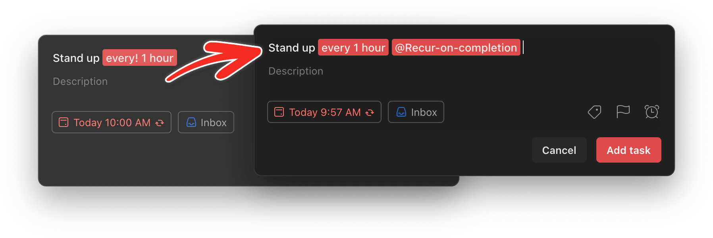
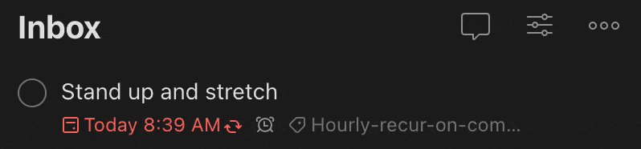
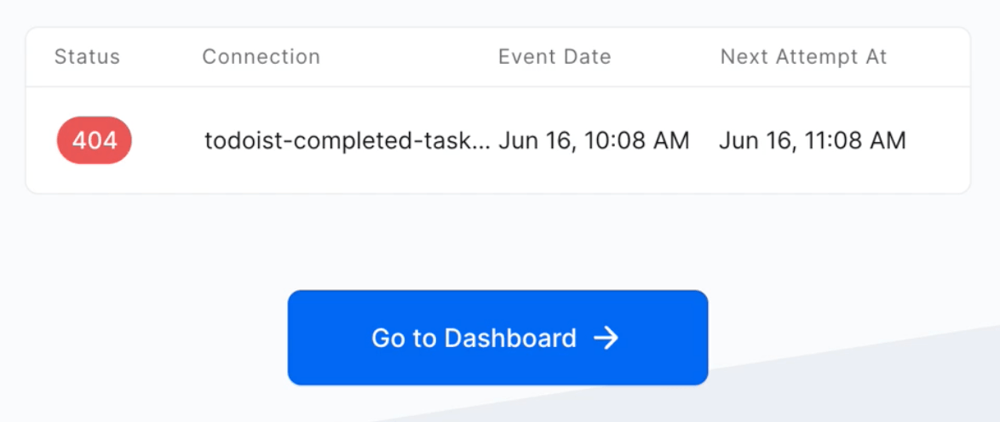
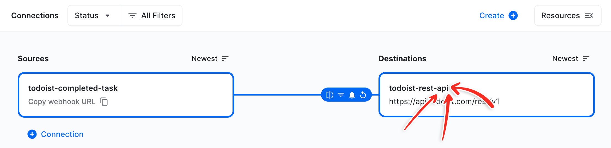
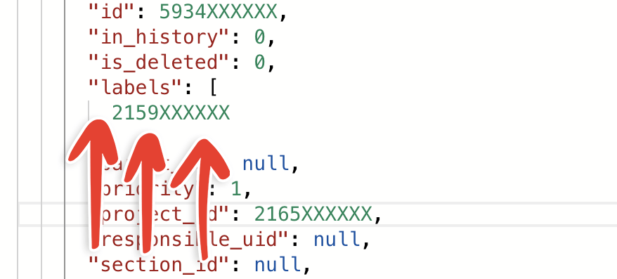
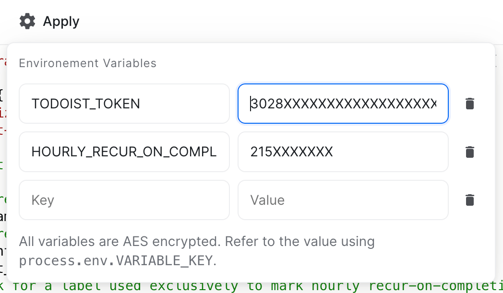
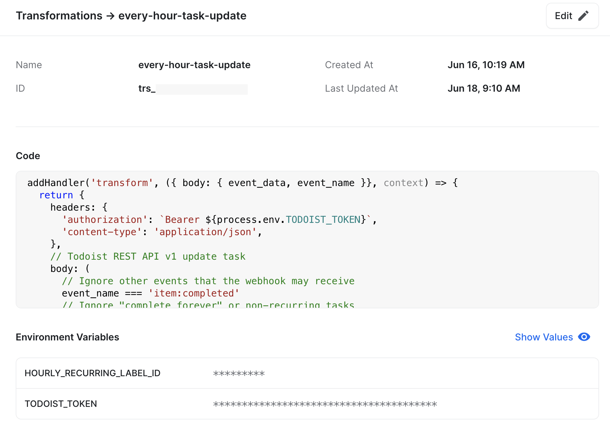

A free workaround for hourly recur-on-completion tasks (e.g. `every! N hours`), a Todoist feature that [was removed](https://twitter.com/todoist/status/1534493110176202754?s=20&t=slFpBUv7YHmEZK9WyNxbnQ). 

Buckle up, there are a lot of steps to get this set up but the result is worth it!

## Background

When an `every! 3 hours` due date task was completed the next occurrence was exactly 3 hours from the completion date, unlike `every 3 hours` which recurs 3 hours after the last due time (even if the new due time is in the past). 

Todoist [removed this capability](https://twitter.com/todoist/status/1534493110176202754?s=20&t=slFpBUv7YHmEZK9WyNxbnQ) and now `every! 3 hours` is not recognized as a valid due date format. Completion of any task that previously used that due date format is permanent so you may need to review recently completed tasks to find those that are no longer recurring.

## How it looks in Todoist

Your tasks will use due dates in the format `every 3 hours` along with a custom label to identify that the next recurrence should be calculated based on the completion time. When you complete the task, Todoist may briefly show the incorrect due time but the due date will be corrected within a few seconds. 

{:.xhdpi.macos-window-shadow-screenshot}

This hourly task was 20 minutes overdue. The automation rescheduled the next occurrence to 1 hour after completion rather than 1 hour after the previous due date:

{:.xhdpi.shadow.rounded}

## Setup

Follow along to set up the magic that fixes the due time.

### Step 1. Set up a sample task in Todoist

Create a task `Testing every 3 hours` and add a new label called `@Hourly-recur-on-completion` or whatever name makes sense to you. This label will only be used for hourly tasks. Do not add any other labels to this sample task. 

Feel free to complete the task a few times to confirm that the due date keeps getting pushed back 3 hours regardless of the completion time.

### Step 2. Sign up for HookDeck

We will use HookDeck to catch the _task completed_ event from Todoist and revise the due date. There is nothing to install, no fees, and generous quotas; your set-and-forget automation will run in the cloud.

1. Click [Get Started](https://hookdeck.com/) to sign up then follow through the guided account setup.
2. Create a workspace for your Todoist automations – I called mine `Todoist`.

### Step 3. Create a connection

The guided setup will ask you to create a connection. If you have already completed setup for a different automation, just click the _Create_ button at the top of your Connections tab and reuse the completed task source and Todoist API destination.

1. Create a source named `todoist-completed-task` and an HTTP URL destination named `todoist-rest-api`.
2. Paste in the following destination URL: `https://api.todoist.com/rest/v1/`.
3. Click _Create Connection_.
4. Copy the URL that HookDeck displays and leave this browser tab open.

### Step 4. Set up the webhook in Todoist

Now that HookDeck is listening for events from Todoist we need to tell Todoist to send them.

1. Go to the [Todoist App Console](https://developer.todoist.com/appconsole.html).
2. Create a new app called `HookDeck Completed Task`, _App service URL_ can be blank since we're not going to publish anything.
3. On the app management screen, paste the HookDeck URL into the _Webhook callback URL_ field.
4. Check the `item:completed` checkbox and leave other watched events unchecked. 
5. Click _Activate Webhook_.

### Step 5. Send your first event to HookDeck

1. Leave the Todoist app management page open and return to the HookDeck browser tab.
2. Open Todoist on any device and complete the task created in _Step 1_.
3. It could take a minute but eventually HookDeck will show an Event Date. A `404`{:.error} error is normal since we have not yet configured the webhook.
4. Click _Go to Dashboard_.

    {:.xhdpi.border.rounded}

### Step 6. Configure your webhook

Congratulations, you're receiving events from Todoist! Now let's add the magic.

1. Click _Connections_ on the left side of your HookDeck workspace dashboard.
2. Click the destination box on your `todoist-completed-task` connection.

    {:.xhdpi.border.rounded}

3. In the right side panel, click the … button next to the ruleset and click _Edit Ruleset_.
4. Change the retry clause to _Retry `exponentially` every `1 minute` up to `5` times_ to automatically avoid temporary Todoist API issues.
5. Click the _Filter_ button.
6. Paste the following code in the _Filter Schema_ pane, this makes sure that all completed tasks where we do not update the due date are ignored.
    ```json
    {
      "due_datetime": {
        "$in": "T"
      }
    }
    ```
7. Click _Save_
8. Click the Transform button and create a new transform called `hourly-recur-on-completion`.
9. Paste the following code which identifies and updates the due date on your `@Hourly-recur-on-completion` labeled tasks into the blank right pane.
    ```js
    addHandler('transform', ({ body: { event_data, event_name }}, context) => {
      return {
        headers: {
          'authorization': `Bearer ${process.env.TODOIST_TOKEN}`,
          'content-type': 'application/json',
        },
        // Todoist REST API v1 update task
        body: (
          // Ignore other events that the webhook may receive
          event_name === 'item:completed'
          // Ignore "complete forever" or non-recurring tasks
          && !event_data.date_completed 
          && event_data.due.is_recurring
          // Check for a label used exclusively to mark hourly recur-on-completion tasks
          && event_data.labels?.includes(+process.env.HOURLY_RECUR_ON_COMPLETION_LABEL_ID)
        )
          ? {
            due_datetime: new Date(
              // There is no "completed date" available; recur based on webhook timing
              Date.now() + 3_600_000 * parseInt(
                // Remove "every" and any other text before the number
                event_data.due.string.replace(/^\D*/, ''), 
                10
              )
            // Todoist does not support milliseconds in ISO 8601 date strings
            ).toISOString().replace(/\.\d+/, ''),
            
            // Required to prevent loss of the task recurrence
            due_string: event_data.due.string,
          }
          // The HookDeck filter will reject this empty request body
          : {},
        // Todoist REST API v1 path
        path: `/tasks/${event_data.id}`,
        query: '',
      };
    });
    ```
10. In the left _Input_ pane, look for `_labels_: [` and copy the number shown on the next line – this is the ID of your `@Hourly-recur-on-completion` label.

    {:.xhdpi.border.rounded}

11. Click _Variables_ at the top of the code pane.
12. Add key `HOURLY_RECUR_ON_COMPLETION_LABEL_ID` and paste the label ID that you copied in step 10.
13. Return to the Todoist app management browser tab and click _Create test token_.
14. Copy the access token. Never share this token; it allows anyone to access your Todoist account.
15. Back in the HookDeck transformation variables popup, add key `TODOIST_TOKEN` and paste the access token as the value.

    {:.xhdpi.border.rounded}

16. Click _Save_ in the upper right.

    {:.xhdpi.border.rounded}

### Step 7. Take it for a spin!

Wow! That was a lot of work but now HookDeck is ready to update your hourly recurring tasks.

1. Find your sample `@Hourly-recur-on-completion` task and complete it.
2. Todoist will show the incorrect date due 3 hours after the previous due date.
3. If all goes well, in a few seconds that due date should update to 3 hours from now!
4. Complete the task again to ensure that it is still recurring.

### Step 8. Update your hourly recurring tasks

Update tasks that previously used `every! N hours` to use `every N hours` and the new `@Hourly-recur-on-completion` label. Note that when Todoist removed the `every! N hours` feature, the next completion of all of those tasks completed them forever. You may need to scan through your completed tasks to uncover any that have been lost.

## Troubleshooting

Use the _All Events_ page in your HookDeck workspace to view a log of handled webhooks.

### Common response codes

* `204`{:.success} – All is well, Todoist updated the task.
* `401`{:.error} – Confirm that your Todoist token has been entered correctly in the `TODOIST_TOKEN` environment variable.
* `404`{:.error} – Confirm that the transformation code has been pasted as shown above. Without it, HookDeck will attempt to relay the webhook data back to the Todoist API.
* `410`{:.error} – Confirm that the destination URL is `https://api.todoist.com/rest/v1/`; the beta REST API at `https://beta.todoist.com/API/v8/` may not be available yet.
* `5xx`{:.error} – The Todoist API may be experiencing a temporary outage.

### Nothing appears in the _All Events_ log

HookDeck does not log requests that are filtered out by your connection rules. Under normal circumstances you will only see events for `@Hourly-recur-on-completion` labeled tasks.

1. Edit the `todoist-completed-task` connection.
2. Click _Open Editor_ next to the filter icon and clear the _Filter Schema_ pane on each of the _Body_, _Headers_, _Query_, and _Path_ tabs.
3. Complete another `@Hourly-recur-on-completion` task.
4. If a request appears in the _All Events_ log, click it.
    1. If the _Body_ of the event looks similar to the following try pasting the `due_datetime` filter again; it may have been incorrect.
        ```json
        "root": {
          "due_datetime": "2022-06-17T00:13:26Z",
          "due_string": "every 2 hours"
        }
        ```
    2. If the _Body_ has a large amount of data from your Todoist task, confirm the following:
        * The task was recurring and was not "completed forever."
        * The `@Hourly-recur-on-completion` label was applied to the task that you completed.
        * The `HOURLY_RECUR_ON_COMPLETION_LABEL_ID` environment variable value matches the label ID shown in the event body.
        * The `item:completed` event is selected in your Todoist app management screen.
    3. If you still do not see any requests, click _Copy webhook URL_ on your HookDeck connection and confirm that the correct URL was pasted into the Todoist app management screen.
